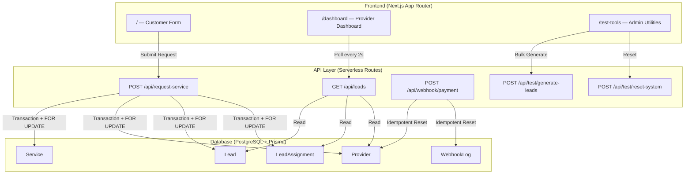
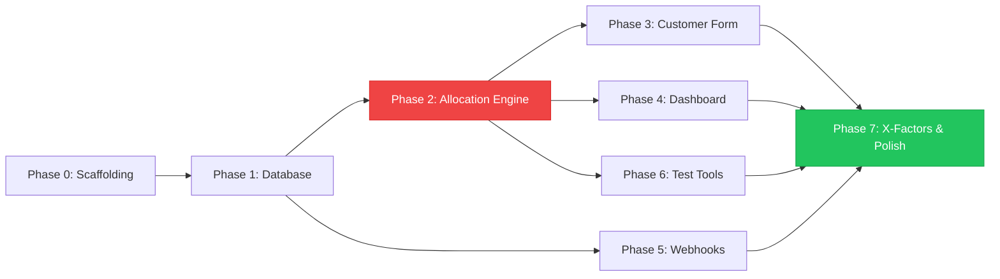

# 🚀 Prowider Mini Lead Distribution System — Implementation Plan

> **Project Type:** B2B Lead Distribution Marketplace Engine  
> **Tech Stack:** Next.js (App Router) · PostgreSQL · Prisma · Short Polling  
> **Target:** Production-grade system with senior-level X-Factors  

---

## Table of Contents

1. [Architecture Overview](#1-architecture-overview)
2. [Phase Breakdown](#2-phase-breakdown)
3. [Phase 0 — Project Scaffolding](#3-phase-0--project-scaffolding)
4. [Phase 1 — Database Layer](#4-phase-1--database-layer)
5. [Phase 2 — Core Allocation Engine](#5-phase-2--core-allocation-engine)
6. [Phase 3 — Frontend: Customer Form](#6-phase-3--frontend-customer-form)
7. [Phase 4 — Frontend: Provider Dashboard](#7-phase-4--frontend-provider-dashboard)
8. [Phase 5 — Webhook & Quota Reset](#8-phase-5--webhook--quota-reset)
9. [Phase 6 — Test Tools & Stress Testing](#9-phase-6--test-tools--stress-testing)
10. [Phase 7 — X-Factors & Polish](#10-phase-7--x-factors--polish)
11. [Verification Checklist](#11-verification-checklist)
12. [Risk Register](#12-risk-register)
13. [Dependency Graph](#13-dependency-graph)

---

## 1. Architecture Overview



### Key Design Decisions

| Decision | Rationale |
|----------|-----------|
| **Row-level locking (`FOR UPDATE`)** | Prevents race conditions in concurrent lead allocation |
| **Short Polling (2s)** | Simpler than WebSockets, meets the 3-second real-time requirement |
| **Database-level unique constraints** | Defense-in-depth: even if app logic fails, DB rejects duplicates |
| **Prisma interactive transactions** | Allows raw SQL + ORM calls in one atomic unit |

---

## 2. Phase Breakdown

| Phase | Name | Duration | Dependencies |
|-------|------|----------|-------------|
| **0** | Project Scaffolding | ~15 min | None |
| **1** | Database Layer | ~30 min | Phase 0 |
| **2** | Core Allocation Engine | ~60 min | Phase 1 |
| **3** | Customer Form (Frontend) | ~30 min | Phase 2 |
| **4** | Provider Dashboard | ~45 min | Phase 2 |
| **5** | Webhook & Quota Reset | ~30 min | Phase 1 |
| **6** | Test Tools & Stress Testing | ~30 min | Phase 2 |
| **7** | X-Factors & Polish | ~30 min | Phase 3-6 |

**Total Estimated Time: ~4.5 hours**

---

## 3. Phase 0 — Project Scaffolding

### Tasks

- [x] **0.1** Initialize Next.js App Router project with TypeScript
  ```
  npx -y create-next-app@latest ./ --typescript --app --eslint --src-dir --no-tailwind --import-alias "@/*"
  ```
  > **Note:** We use `--no-tailwind` as default, but TailwindCSS will be added since X-Factor 2 mentions Tailwind animations. We will install it separately for full control.

- [x] **0.2** Install core dependencies
  ```
  npm install prisma @prisma/client
  npm install react-hot-toast
  ```

- [x] **0.3** Install dev dependencies
  ```
  npm install -D @types/node tsx
  ```

- [x] **0.4** Initialize Prisma
  ```
  npx prisma init --datasource-provider postgresql
  ```

- [x] **0.5** Configure `.env` with PostgreSQL connection string

- [x] **0.6** Set up project folder structure:
  ```
  src/
  ├── app/
  │   ├── api/
  │   │   ├── request-service/route.ts      # FR-1, FR-2, FR-3
  │   │   ├── leads/route.ts                # FR-4 polling endpoint
  │   │   ├── webhook/payment/route.ts       # FR-5 idempotent webhook
  │   │   ├── test/generate-leads/route.ts   # X-Factor 1
  │   │   └── test/reset-system/route.ts     # Testing utility
  │   ├── page.tsx                           # Customer form
  │   ├── dashboard/page.tsx                 # Provider dashboard
  │   ├── test-tools/page.tsx                # Admin test panel
  │   ├── layout.tsx                         # Root layout
  │   └── globals.css                        # Design system
  ├── lib/
  │   ├── prisma.ts                          # Singleton Prisma client
  │   ├── allocation-engine.ts               # Core fairness engine
  │   └── service-rules.ts                   # Mandatory provider mapping
  └── types/
      └── index.ts                           # Shared TypeScript types
  ```

### Verification ✅
- [x] `npm run dev` starts without errors
- [x] `npx prisma --version` works
- [x] Folder structure matches the plan

---

## 4. Phase 1 — Database Layer

### Tasks

- [x] **1.1** Define Prisma Schema

```prisma
// prisma/schema.prisma

generator client {
  provider = "prisma-client-js"
}

datasource db {
  provider = "postgresql"
  url      = env("DATABASE_URL")
}

model Service {
  id        Int        @id @default(autoincrement())
  name      String     @unique
  leads     Lead[]
  providers Provider[] @relation("ServiceProviders")
  createdAt DateTime   @default(now())
}

model Provider {
  id             Int              @id @default(autoincrement())
  name           String           @unique
  leadsCount     Int              @default(0)
  maxQuota       Int              @default(10)
  lastAssignedAt DateTime         @default(now())
  assignments    LeadAssignment[]
  services       Service[]        @relation("ServiceProviders")
  createdAt      DateTime         @default(now())
}

model Lead {
  id          Int              @id @default(autoincrement())
  name        String
  phone       String
  serviceId   Int
  service     Service          @relation(fields: [serviceId], references: [id])
  assignments LeadAssignment[]
  createdAt   DateTime         @default(now())

  @@unique([phone, serviceId])  // FR-1: Duplicate prevention
}

model LeadAssignment {
  id         Int      @id @default(autoincrement())
  leadId     Int
  providerId Int
  isMandatory Boolean @default(false)
  lead       Lead     @relation(fields: [leadId], references: [id])
  provider   Provider @relation(fields: [providerId], references: [id])
  createdAt  DateTime @default(now())

  @@unique([leadId, providerId])  // Fail-safe: no double assignments
}

model WebhookLog {
  id        Int      @id @default(autoincrement())
  eventId   String   @unique  // FR-5: Idempotency key
  payload   Json
  createdAt DateTime @default(now())
}
```

- [x] **1.2** Run migration
  ```
  npx prisma migrate dev --name init
  ```

- [x] **1.3** Create Prisma singleton client (`src/lib/prisma.ts`)

- [x] **1.4** Create seed script (`prisma/seed.ts`) — **X-Factor 4**

> [!IMPORTANT]
> The seed script must populate:
> - **3 Services:** Service 1, Service 2, Service 3
> - **8 Providers:** Provider 1 through Provider 8
> - **Service-Provider Pool Mappings:**
>   - Service 1 → Providers 1, 2, 3 (Provider 1 = Mandatory)
>   - Service 2 → Providers 4, 5, 6 (Provider 5 = Mandatory)
>   - Service 3 → Providers 1, 4, 7, 8 (Provider 1 AND Provider 4 = Mandatory)

- [x] **1.5** Configure `package.json` with Prisma seed command:
  ```json
  "prisma": {
    "seed": "tsx prisma/seed.ts"
  }
  ```

- [x] **1.6** Run seed: `npx prisma db seed`

### Verification ✅
- [x] `npx prisma studio` shows all 3 services, 8 providers with correct pool mappings
- [x] Attempting to insert duplicate `(phone, serviceId)` fails at DB level
- [x] All providers start with `leadsCount = 0`
- [x] Running seed twice doesn't create duplicates (use `upsert`)

---

## 5. Phase 2 — Core Allocation Engine

> [!CAUTION]
> This is the most critical and complex phase. The entire system's correctness depends on this engine.

### Tasks

- [x] **2.1** Create service rules config (`src/lib/service-rules.ts`)

```typescript
// Maps serviceId → mandatory providerIds
export const MANDATORY_RULES: Record<number, number[]> = {
  1: [1],      // Service 1 → Provider 1
  2: [5],      // Service 2 → Provider 5
  3: [1, 4],   // Service 3 → Provider 1 AND Provider 4
};

export const TARGET_ASSIGNMENTS = 3; // Every lead → exactly 3 providers
```

- [x] **2.2** Implement the allocation engine (`src/lib/allocation-engine.ts`)

**Algorithm (step-by-step):**

```
1. BEGIN Prisma Interactive Transaction (timeout: 10s)
2. EXECUTE: SELECT * FROM "Provider" FOR UPDATE  → Row-level lock
3. CHECK: Does Lead with (phone, serviceId) already exist?
   → YES: THROW { code: "DUPLICATE_LEAD_SUBMISSION", status: 409 }
   → NO: Continue
4. LOAD mandatory rules for this serviceId
5. FOR EACH mandatory provider:
   → CHECK quota (leadsCount < maxQuota)
   → IF available: PUSH to selectedProviders[]
6. CALCULATE remainingSlots = 3 - selectedProviders.length
7. IF remainingSlots > 0:
   → QUERY service pool: WHERE leadsCount < maxQuota
                          AND id NOT IN selectedProviders
                          ORDER BY lastAssignedAt ASC
                          LIMIT remainingSlots
   → PUSH results to selectedProviders[]
8. CREATE Lead record
9. FOR EACH selectedProvider:
   → CREATE LeadAssignment (with isMandatory flag)
   → UPDATE Provider: leadsCount += 1, lastAssignedAt = NOW()
10. COMMIT Transaction
11. RETURN { lead, assignments: selectedProviders[] }
```

- [x] **2.3** Implement the API route (`src/app/api/request-service/route.ts`)

**Input validation:**
```typescript
{
  name: string,       // required, non-empty
  phone: string,      // required, non-empty
  serviceId: number   // required, must be 1, 2, or 3
}
```

**Response shapes (X-Factor 3):**
```typescript
// Success (200)
{
  success: true,
  data: {
    leadId: number,
    assignments: Array<{
      providerId: number,
      providerName: string,
      isMandatory: boolean
    }>
  }
}

// Duplicate (409)
{
  success: false,
  code: "DUPLICATE_LEAD_SUBMISSION",
  message: "This phone number is already registered for this specific service."
}

// Quota Exhausted (503)
{
  success: false,
  code: "INSUFFICIENT_PROVIDERS",
  message: "Not enough providers with available quota for this service."
}

// Validation Error (400)
{
  success: false,
  code: "VALIDATION_ERROR",
  message: "Missing required fields: name, phone, serviceId."
}
```

- [x] **2.4** Create TypeScript types (`src/types/index.ts`)

### Verification ✅
- [x] Submit a lead → returns 200 with exactly 3 providers
- [x] Submit same phone+service → returns 409
- [x] Submit same phone, different service → returns 200 ✅
- [x] Mandatory providers appear first in assignments with `isMandatory: true`
- [x] After 10 leads to one provider, they stop receiving leads
- [x] Pool rotation follows `lastAssignedAt ASC` (round-robin)

---

## 6. Phase 3 — Frontend: Customer Form

### Tasks

- [x] **3.1** Design the global CSS design system (`src/app/globals.css`)
  - Dark theme with glassmorphism
  - CSS custom properties for colors, spacing, typography
  - Import Google Font (Inter or Outfit)
  - Form styling, button hover effects, micro-animations

- [x] **3.2** Build the customer form page (`src/app/page.tsx`)
  - Service selection (dropdown or cards for Service 1, 2, 3)
  - Name input
  - Phone input
  - Submit button with loading state
  - Success animation / confirmation
  - Error handling with toast notifications
  - Responsive layout

- [x] **3.3** Update root layout (`src/app/layout.tsx`)
  - Meta tags (SEO)
  - Font loading
  - Toast provider

### Verification ✅
- [x] Form renders beautifully on desktop and mobile
- [x] Submitting shows loading state → success confirmation
- [x] Duplicate submission shows clear error message
- [x] All form fields validate before submission

---

## 7. Phase 4 — Frontend: Provider Dashboard

### Tasks

- [x] **4.1** Create polling API endpoint (`src/app/api/leads/route.ts`)
  - Returns all providers with their current `leadsCount`, `maxQuota`
  - Returns recent lead assignments with timestamps
  - Supports optional `?since=<timestamp>` for incremental updates

- [x] **4.2** Build dashboard page (`src/app/dashboard/page.tsx`)
  - **Provider Cards Grid:** Show all 8 providers with:
    - Name
    - Quota bar: `leadsCount / maxQuota` with visual progress
    - Status badge: Active / Frozen
    - Last assigned time
  - **Recent Assignments Feed:** Scrollable list of latest assignments
  - **Short Polling:** Fetch every 2 seconds
  - **X-Factor 2:** Toast notification + green row flash on new data

- [x] **4.3** Implement polling hook (`src/hooks/usePolling.ts` or inline)
  - Track previous state to detect new assignments
  - Fire toast on delta detection

### Verification ✅
- [x] Dashboard loads and shows all 8 providers
- [x] Quota bars update within 3 seconds of a new lead (FR-4)
- [x] Frozen providers (quota=10) show distinct visual state
- [x] Toast fires when new lead arrives
- [x] No page reload required

---

## 8. Phase 5 — Webhook & Quota Reset

### Tasks

- [x] **5.1** Implement webhook endpoint (`src/app/api/webhook/payment/route.ts`)

**Input:**
```typescript
{
  eventId: string,    // Unique transaction ID (idempotency key)
  providerId: number,
  action: "RESET_QUOTA",
  newQuota?: number   // Defaults to 10
}
```

**Algorithm:**
```
1. CHECK: Does WebhookLog with this eventId exist?
   → YES: Return 200 with { alreadyProcessed: true }
   → NO: Continue
2. INSERT WebhookLog record
3. UPDATE Provider: SET leadsCount = 0 (or custom newQuota)
4. RETURN 200 Success
```

**Error Responses (X-Factor 3):**
```typescript
// Already processed (200 — idempotent success)
{
  success: true,
  code: "ALREADY_PROCESSED",
  message: "This webhook event has already been processed."
}

// Provider not found (404)
{
  success: false,
  code: "PROVIDER_NOT_FOUND",
  message: "No provider found with the given ID."
}
```

- [x] **5.2** Add webhook trigger button to test-tools page

### Verification ✅
- [x] Sending webhook resets provider's leadsCount to 0
- [x] Sending the **same eventId** twice → second call returns `ALREADY_PROCESSED`
- [x] Dashboard reflects quota reset within 3 seconds
- [x] Provider can receive leads again after reset

---

## 9. Phase 6 — Test Tools & Stress Testing

### Tasks

- [x] **6.1** Create system reset endpoint (`src/app/api/test/reset-system/route.ts`)
  - Deletes all leads, assignments, webhook logs
  - Resets all providers to `leadsCount = 0`
  - Returns confirmation

- [x] **6.2** Create bulk lead generator (`src/app/api/test/generate-leads/route.ts`)
  - Accepts `{ count: number, serviceId: number }`
  - Generates leads sequentially (to respect locking)
  - Returns detailed allocation log for each lead (X-Factor 1)

- [x] **6.3** Build test-tools page (`src/app/test-tools/page.tsx`)
  - **"Generate 10 Leads" Button** → Calls bulk endpoint
  - **Terminal-style log display** (X-Factor 1):
    - Monospace font, dark background
    - Each lead prints: `[Lead N] Created. Assigned to: Provider X (Mandatory), Provider Y (Pool), Provider Z (Pool)`
    - Auto-scrolls to bottom
  - **"Reset System" Button** → Clears all data
  - **"Trigger Payment Webhook" Form:**
    - Provider ID selector
    - Event ID input (auto-generated UUID)
    - Submit button
  - **System State Snapshot** → Shows current provider quotas

### Verification ✅
- [x] "Generate 10 Leads" produces visible terminal log with correct allocation
- [x] Round-robin order is visually verifiable in the log
- [x] "Reset System" clears everything and dashboard updates
- [x] Webhook form successfully resets a provider's quota
- [x] No 500 errors during stress test

---

## 10. Phase 7 — X-Factors & Polish

### Tasks

- [x] **7.1** X-Factor 1: Terminal allocation log display (covered in Phase 6)

- [x] **7.2** X-Factor 2: Optimistic UI & Toast Notifications
  - Install `react-hot-toast`
  - Dashboard: Compare previous poll data with new data
  - On new assignment detected: Fire toast with 🎉 emoji
  - Flash the updated provider card with a soft-green glow animation
  - CSS keyframe: `@keyframes flash-green { from { background: rgba(34,197,94,0.3) } to { background: transparent } }`

- [x] **7.3** X-Factor 3: Clean API Error Mapping (covered in Phases 2 & 5)
  - Audit all API routes for consistent error shape
  - No raw `500` errors — every failure path returns a structured JSON

- [x] **7.4** X-Factor 4: Database Seeding (covered in Phase 1)
  - Ensure `npx prisma db seed` works flawlessly

- [x] **7.5** Final UI Polish
  - Navigation bar with links: Home | Dashboard | Test Tools
  - Loading skeletons on dashboard
  - Responsive design audit (mobile + desktop)
  - Smooth page transitions
  - Favicon and page titles

- [x] **7.6** Code Quality Pass
  - Remove console.logs
  - Add brief JSDoc comments on key functions
  - Ensure consistent naming conventions
  - Type-safety audit: no `any` types

### Verification ✅
- [x] Toast notifications fire correctly on dashboard
- [x] Green flash animation is visible and subtle
- [x] All API errors return structured JSON (test with invalid inputs)
- [x] `npx prisma db seed` works from clean state
- [x] UI looks premium on both desktop (1440px) and mobile (375px)

---

## 11. Verification Checklist

### Full Integration Test Sequence

Run this exact sequence to verify the entire system end-to-end:

```
Step 1:  npx prisma migrate reset --force    → Clean slate
Step 2:  npx prisma db seed                  → Seed data
Step 3:  npm run dev                         → Start server
Step 4:  Open /dashboard                     → Should show 8 providers, all at 0/10
Step 5:  Open / (customer form)              → Submit lead for Service 1
Step 6:  Check /dashboard                    → Provider 1 (mandatory) + 2 pool providers at 1/10
Step 7:  Submit same phone + Service 1       → Should get 409 error
Step 8:  Submit same phone + Service 2       → Should succeed (200)
Step 9:  Open /test-tools                    → Generate 10 leads for Service 1
Step 10: Check terminal log                  → Verify round-robin order
Step 11: Check /dashboard                    → Provider quotas updated, toasts fired
Step 12: Generate leads until Provider 1     → hits 10/10 → should freeze
Step 13: Submit another Service 1 lead       → Provider 1 should NOT be assigned
Step 14: Trigger payment webhook             → Reset Provider 1's quota
Step 15: Trigger same webhook again          → Should return "ALREADY_PROCESSED"
Step 16: Submit Service 1 lead               → Provider 1 should be back in rotation
Step 17: Check /dashboard                    → All data reflects correctly
```

### Automated Verification Points

| # | Test Case | Expected | FR |
|---|-----------|----------|-----|
| 1 | Duplicate phone+service | 409 Conflict | FR-1 |
| 2 | Same phone, different service | 200 OK | FR-1 |
| 3 | Provider at quota 10 | Excluded from allocation | FR-2 |
| 4 | Lead assigned to exactly 3 providers | Array length = 3 | FR-3 |
| 5 | Mandatory providers included | isMandatory = true | FR-3 |
| 6 | Round-robin ordering | lastAssignedAt ASC | FR-3 |
| 7 | Dashboard updates < 3 seconds | Visual confirmation | FR-4 |
| 8 | Duplicate webhook eventId | Returns ALREADY_PROCESSED | FR-5 |

---

## 12. Risk Register

| Risk | Impact | Mitigation |
|------|--------|------------|
| **PostgreSQL not installed locally** | Blocks all development | Use Docker: `docker run -p 5432:5432 -e POSTGRES_PASSWORD=password postgres:16` or use a cloud provider (Neon, Supabase) |
| **Race condition in allocation** | Double-counting leads | `FOR UPDATE` row lock inside Prisma transaction — already designed |
| **Prisma transaction timeout** | Fails under load | Set `timeout: 10000` in transaction options |
| **Short polling hammers DB** | Performance degradation | 2-second interval is conservative; add connection pooling if needed |
| **Seed script fails on re-run** | Dirty state | Use `upsert` instead of `create` in seed script |
| **TailwindCSS conflicts with custom CSS** | Styling inconsistencies | Use Tailwind only for utility classes, custom CSS for design system |

---

## 13. Dependency Graph



> [!NOTE]
> **Phase 2 (red)** is the critical path — everything depends on the allocation engine being correct.  
> **Phase 7 (green)** is the final polish — it makes the difference between a pass and an advanced pass.

---

## File Manifest (Complete)

| File | Purpose | Phase |
|------|---------|-------|
| `prisma/schema.prisma` | Database schema with unique constraints | 1 |
| `prisma/seed.ts` | Seed 3 services, 8 providers, pool mappings | 1 |
| `src/lib/prisma.ts` | Prisma client singleton | 1 |
| `src/lib/service-rules.ts` | Mandatory provider rules config | 2 |
| `src/lib/allocation-engine.ts` | Core fairness engine with FOR UPDATE | 2 |
| `src/types/index.ts` | Shared TypeScript interfaces | 2 |
| `src/app/api/request-service/route.ts` | Lead submission endpoint | 2 |
| `src/app/api/leads/route.ts` | Dashboard polling data endpoint | 4 |
| `src/app/api/webhook/payment/route.ts` | Idempotent quota reset | 5 |
| `src/app/api/test/generate-leads/route.ts` | Bulk lead generator | 6 |
| `src/app/api/test/reset-system/route.ts` | System reset utility | 6 |
| `src/app/layout.tsx` | Root layout with nav + fonts + meta | 3 |
| `src/app/globals.css` | Design system + animations | 3 |
| `src/app/page.tsx` | Customer form | 3 |
| `src/app/dashboard/page.tsx` | Provider dashboard with polling | 4 |
| `src/app/test-tools/page.tsx` | Admin test panel with terminal log | 6 |
| `.env` | DATABASE_URL | 0 |

---

> **Next Step:** Confirm this plan looks good, then we begin Phase 0 — scaffolding the Next.js project.
